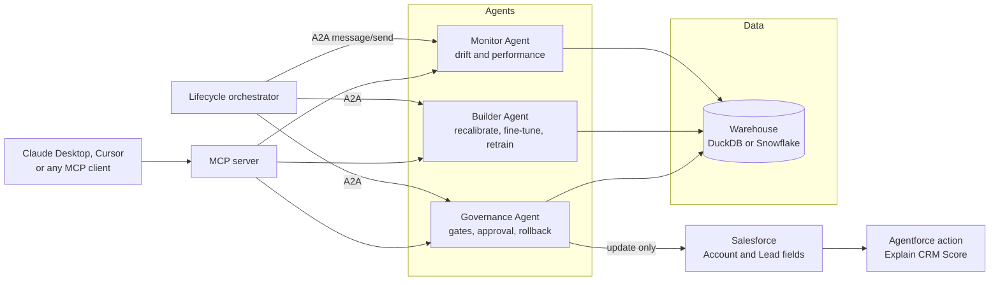
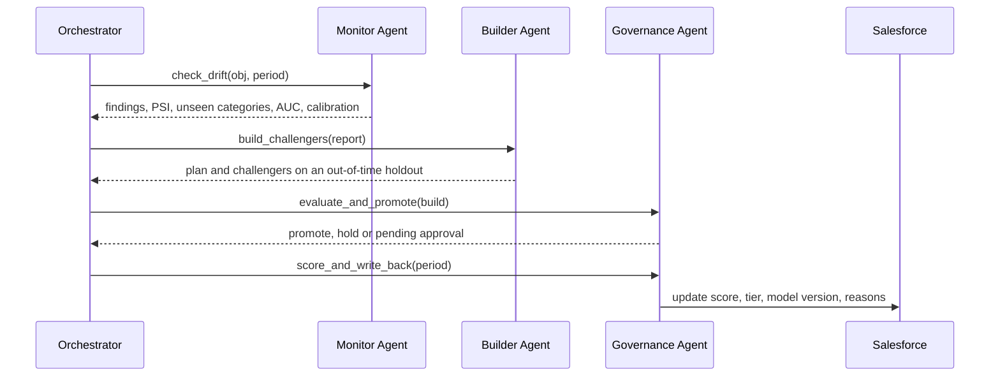

# CRM scoring agents

Agent lifecycle management for CRM scoring models. Three agents keep a lead score and an account score honest in production. They watch for drift, build challengers, gate every promotion and write scores back to Salesforce. Every step is exposed over MCP and A2A, and every step is audited.

The lead score rebuilds monthly on the latest leads. The account score rescores the whole book every quarter.

Live dashboard: [huggingface.co/spaces/dsoosai/crm-scoring-agents](https://huggingface.co/spaces/dsoosai/crm-scoring-agents)

## Why this exists

The original notebooks ([AccountScoring_Sample](https://github.com/dsoosai/AccountScoring_Sample)) score with hand-set weights and never see an outcome. They cannot learn and cannot tell you when they are wrong. They also carry a quiet bug: every one-hot category gets the same weight, so industry, role, department and keyword add the same constant to every record. The v0 lead score is really `0.30 + 0.20 * site_visits / max`.

A score that sales and RevOps act on needs what any production system needs: monitoring, controlled change, approval, rollback and an audit trail. This repo is that lifecycle, built as agents.

## What the replay shows

`crm-agent simulate` replays 15 months of leads and 6 quarters of accounts with scripted drift. Three models are measured on the same outcomes each period: the agent-managed champion, the first model frozen in time, and the v0 rules.

| Latest outcomes | Managed champion | Frozen first model | v0 rules |
| --- | --- | --- | --- |
| Leads, 2026-08 | 0.740 AUC | 0.689 | 0.631 |
| Accounts, 2026Q2 | 0.812 AUC | 0.773 | 0.684 |

Numbers come from the pinned libraries in `requirements-lock.txt`. Other versions move them slightly.

What happened along the way:

- **Nov 2025, leads.** A paid campaign inflates site visits. The monitor flags it the day the leads land (PSI 0.26), a month before outcomes confirm it.
- **Dec 2025, leads.** Outcomes confirm the damage: AUC down 0.09, scores 5 points too hot. Every challenger was trained before the campaign, so all fail the gates. The agent holds and says why.
- **Jan 2026, leads.** A retrain with campaign data wins (0.763 vs 0.699) and promotes itself. Lead promotions need no human.
- **Mar to May 2026, leads.** A new search keyword, "AI Agents", appears. The monitor names it the first month. The builder explains that no update can learn it until outcomes land. In May a retrain learns it and is promoted.
- **2025Q4, accounts.** Calibration drifts. A recalibration and a full retrain rank equally well. The agent picks the recalibration: 4% of accounts change tier instead of 23%. Tiers drive territories, so stability is a gate.
- **2026Q2, accounts.** Expansion now follows product adoption, not margin. A warm-start fine-tune adapts faster than a full retrain and is promoted after RevOps approval.
- **2026Q3, accounts.** A new segment, Public Sector, reaches 8% of the book. A retrain that knows it is chosen over an equally accurate fine-tune that does not.

Open `space/index.html` after a run, or the [live dashboard](https://huggingface.co/spaces/dsoosai/crm-scoring-agents), for the full timeline.

## Architecture



One cycle is four messages:



The Builder Agent cannot promote. The Governance Agent cannot train. Separation of duties is part of the design.

## Agent lifecycle capabilities

| Capability | How it works here | Where |
| --- | --- | --- |
| Model building | Gradient boosted trees on an out-of-time split, recency-weighted, Platt-calibrated, tiered A to D | `crmscore/model.py` |
| Drift management | PSI per feature the day records land. Unseen categories. AUC, calibration gap and lift once outcomes arrive. Label delay handled per object. | `crmscore/drift.py`, `Lifecycle.monitor` |
| Fine-tuning | Three update paths, cheapest first: recalibration, warm-start fine-tune (more trees on the newest data), full retrain. The builder picks paths from the findings. | `ScoringModel.recalibrated`, `.finetuned` |
| Promotion gates | Beat the champion by 0.01 AUC on the same holdout (or fix a failing champion), Brier, calibration, top-decile lift, per-industry AUC floor, tier stability for accounts | `Lifecycle.gate_check`, `config/lifecycle.yaml` |
| Human in the loop | Account promotions wait for RevOps. Lead promotions go automatically when gates pass. | `require_human_approval` |
| Rollback | One call restores the previous champion | `Lifecycle.rollback` |
| Registry and model cards | Every version, its windows, metrics, gates, importance, approver and runtime versions. Stored in the warehouse, not on a laptop. | `MODEL_REGISTRY`, `crm-agent card` |
| Explainability | Per-record reasons in points, written to `Score_Reasons__c` | `ScoringModel.explain` |
| Audit | Every agent action with who, what, when and why | `AUDIT_LOG` |
| Interop | MCP tools for any MCP client. A2A agent cards and `message/send` between agents. | `crmscore/mcp_server.py`, `crmscore/agents/a2a.py` |

## Quick start (local, no accounts needed)

Needs Python 3.11 or later. On a Mac where `python3` is older, run `make setup PY=python3.13`.

```bash
git clone https://github.com/dsoosai/crm-scoring-agents && cd crm-scoring-agents
make setup          # venv, pinned libraries, package
make demo           # replay and render space/index.html (about a minute)
open space/index.html
```

Then poke at it:

```bash
.venv/bin/crm-agent registry lead
.venv/bin/crm-agent card account-v12
.venv/bin/crm-agent explain lead L-202609-24011
.venv/bin/crm-agent rollback lead --reason "Marketing reports the new grades look off"
```

## Run the agents over A2A

DuckDB allows one writing process, so replay history first and leave the last period for the live run.

```bash
make demo-live      # replay all but the last month and quarter
make a2a            # terminal 1: three agents on http://127.0.0.1:9100
make cycle-a2a      # terminal 2: final lead and account cycles over A2A
curl http://127.0.0.1:9100/agents/monitor-agent/.well-known/agent-card.json
.venv/bin/crm-agent approve account-v12 --approver "Your name, RevOps" --a2a-url http://127.0.0.1:9100
```

The account cycle stops at `pending_approval` until someone approves it.

## Use it from Claude Desktop, Claude Code or Cursor (MCP)

Add this to the client's MCP config, with your paths:

```json
{
  "mcpServers": {
    "crm-scoring-agents": {
      "command": "/Users/you/crm-scoring-agents/.venv/bin/crm-agent",
      "args": ["--workdir", "/Users/you/crm-scoring-agents/demo_run", "mcp"]
    }
  }
}
```

Then ask: "Check drift on leads for 2026-03." "Why was account-v12 promoted over the fine-tune?" "Explain the score for lead L-202609-24011."

Tools: `lifecycle_status`, `list_models`, `get_model_card`, `check_drift`, `build_challengers`, `run_lifecycle_cycle`, `approve_promotion`, `rollback_model`, `explain_record`, `audit_trail`.

## Live mode: Salesforce, Snowflake, Hugging Face and GitHub

Everything above runs with no accounts. Live mode swaps the backends with environment variables and changes no code:

| Setting | Local | Live |
| --- | --- | --- |
| `CRM_WAREHOUSE` | `duckdb` | `snowflake` |
| `CRM_TARGET` | `mock` | `salesforce` |

Each switch is independent. Salesforce works without Snowflake: DuckDB stays the warehouse.

Step-by-step setup is in [docs/LIVE_SETUP.md](docs/LIVE_SETUP.md). The Salesforce metadata (six fields per object, a permission set and an Agentforce Apex action) is in [salesforce/](salesforce/). The Agentforce agent setup is in [salesforce/AGENTFORCE_SETUP.md](salesforce/AGENTFORCE_SETUP.md).

## Policy lives in config

`config/lifecycle.yaml` holds cadence, windows, drift thresholds and gates. Change policy there, not in code.

## Layout

```
crmscore/
  data/synth.py          synthetic CRM history with scripted drift
  baseline.py            v0 rules ported from the notebooks
  features.py            feature contracts per object
  model.py               scoring model and the three update paths
  drift.py               PSI, unseen categories, performance
  lifecycle.py           registry, monitor, build, gates, promote, rollback, score
  agents/agents.py       Monitor, Builder and Governance agents
  agents/a2a.py          A2A agent cards, message/send server and client
  agents/orchestrator.py one cycle
  mcp_server.py          MCP tools
  warehouse.py           DuckDB and Snowflake backends
  crm.py                 mock org and Salesforce write-back
  narrate.py             optional LLM summary (it narrates, never decides)
  dashboard.py           static dashboard, also the Hugging Face Space
salesforce/              fields, permission set, Apex action and test
snowflake/               setup and views
config/lifecycle.yaml    policy
.github/workflows/       CI, live cycle, Space publish
```

## Honest limits

- The data is synthetic. The drift is scripted so every lifecycle path gets exercised.
- The A2A layer implements agent cards and `message/send` only. No streaming or push notifications.
- Live mode does not ingest from Salesforce into Snowflake. In production that is a connector or Data 360.
- DuckDB is single-writer. Run the MCP server and the A2A server one at a time locally. Snowflake has no such limit.
- The LLM, if configured, only writes the cycle summary. Promotions are decided by gates, not by a model.

## License

MIT
