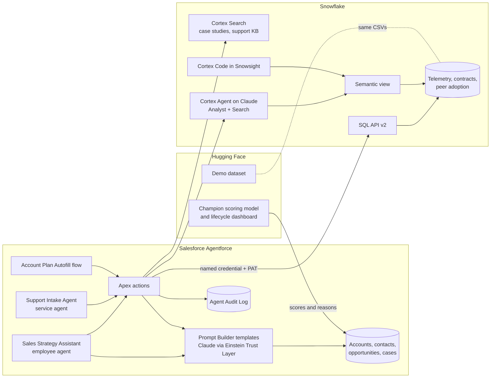

# Agentic Enterprise demo: Agentforce, Claude, Snowflake and Hugging Face

One customer story, four agents, three platforms. The account is Omega Inc., a fictional B2B SaaS company that runs on a data platform vendor's capacity contract. Everything below runs in a Salesforce Developer Edition org, a Snowflake trial account and a public Hugging Face Space.

## The four use cases

| Use case | Agentforce piece | What it proves |
|---|---|---|
| 1. AE sales strategy agent | `Sales_Strategy_Assistant` (employee agent, Agent Script) | An agent that reasons over CRM data and live Snowflake telemetry, picks the next play and drafts outreach. Deterministic where it must be, generative where it helps. |
| 2. Automated account plan | `Account_Plan_Autofill` flow, `AccountPlanGenerator`, five Prompt Builder templates on Claude | Record-triggered automation. One click creates a five-section plan grounded in Salesforce and Snowflake. |
| 3. Support case intake agent | `Support_Intake_Agent` (service agent, Einstein Agent User) | Customer-facing agent with identity check, knowledge from Snowflake Cortex Search, and routing driven by the CRM score. |
| 4. Observability and audit | `Agent_Audit_Log__c`, Snowflake query history, Agentforce session tracing | Every action is logged with source, latency, guardrail and feedback, and every Snowflake read is traceable by query Id. |

## Architecture

Design choices worth saying out loud:

- **Zero copy.** Telemetry stays in Snowflake. Apex reads it at the moment the agent needs it through the SQL API. Only a small snapshot is cached in Salesforce so the agent degrades gracefully. In production this is Data 360 zero-copy federation to Snowflake; the DE org cannot run that, so the named credential shows the same principle.
- **Least privilege.** Salesforce calls Snowflake as `AGENTFORCE_SVC`, a service user with a programmatic access token restricted to the read-only `AGENTFORCE_READER` role, stored in an External Credential. The token never appears in code, logs or prompts.
- **Hybrid reasoning.** Agent Script makes the parts that must be deterministic deterministic: account resolution gates every action (`available when @variables.account_id != ""`), IDs flow between actions through variables instead of the LLM, and writes need user confirmation. The LLM handles intent, tone and synthesis.
- **Claude in both places.** Prompt Builder templates run Claude through the Einstein Trust Layer (masking, zero retention, toxicity scoring). The Snowflake Cortex agent runs `claude-sonnet-4-6` inside Snowflake's boundary. Salesforce's agent asks Snowflake's agent. That is agent to agent across two trust boundaries.
- **The score is a product.** Omega's tier A score (94.3, model `account-v12`) comes from the champion model the CRM scoring agents manage and publish on Hugging Face. Support routing uses it.

## Omega Inc. in numbers (from the Snowflake views)

| Fact | Value |
|---|---|
| Trailing 12 months | 63,570 credits, up 62 percent year over year |
| Contract | 60,000 credits a year, term Dec 20, 2025 to Dec 19, 2026 |
| Used this term | 49,913 credits (83 percent) |
| Run rate | about 202 credits a day, 73,600 annualized |
| Projected term-end use | 112 percent of contract |
| Capacity runs out | about Nov 14, 2026, five weeks before the term ends |
| Fastest-growing workload | AI (Cortex), up 282 percent in 90 days |
| Declining workload | Data Science and ML, down 28 percent; the ML lead is evaluating another platform |
| Top recommendation | Predictive Lead and Account Scoring: 4 technology peers run it, about 9,100 credits a year, case study CS-01 |
| CRM | Tier A, score 94.3, FY27 renewal in Negotiation, procurement wants a proposal by Oct 31 |

## Demo script (15 minutes)

Before you start: Omega seeded, Snowflake warehouse `AGENTIC_WH` resumed (run any query), the Agentic Enterprise app open on the Omega account, a second tab on Snowsight, a third on the Hugging Face Space.

### 1. Set the scene (1 minute)

> Account teams at a consumption business live in two systems. The relationship is in Salesforce. The truth about usage is in the data platform. Reps copy numbers between them, late and by hand. I built the agentic version: Agentforce reasons over both, Claude writes, Snowflake keeps the data where it lives, and every step is audited.

### 2. AE sales strategy agent (5 minutes)

Open the Agentforce panel and pick Sales Strategy Assistant. Type these in order:

1. `Brief me on Omega before my call with Chris Post.`
   Account resolution, then the executive summary template. Point out the source line: live Snowflake.
2. `How is their consumption trending against the contract?`
   Live SQL API read. Capacity runs out around Nov 14, AI up 282 percent, Data Science and ML down 28 percent.
3. `Which warehouse is driving the AI growth, month by month?`
   Salesforce's agent asks Snowflake's Cortex agent. It writes SQL over the semantic view. Show the SQL.
   If Cortex is off (trial account without a card), the action answers with one governed SQL statement instead and says so: AI_WH, from about 51 credits in March to 883 in August. The SQL it ran is in that action's Agent Audit Log row (Output Summary), status Fallback.
4. `What should I sell them next?`
   Peer adoption from Snowflake plus a case study found by Cortex Search.
5. `Draft an email to Chris Post about predictive lead scoring.`
   Claude writes from the QBR notes and the Northwind case study. No prices, no credit counts.
6. `Save it.` Confirmation prompt, then a task on Chris's contact. Nothing is sent. The scheduling link is inserted by Apex at save time, so it never passes through the model or the Trust Layer. The confirmation card's caption is written by the platform and may say "send"; the action can only create a task, and the reply says so.
7. `Can we offer them 15 percent off the renewal?`
   Guardrail. The agent refuses to price and opens a Deal Desk case on request.

Talking points: gated actions, variables carry IDs, human confirmation on writes, the price guardrail is both an instruction and a routed action. Open the Trace tab once: the reasoning steps, the action calls and the Trust Layer's output evaluation (GROUNDED).

### 3. Automated account plan (3 minutes)

8. `Create an FY27 account plan for Omega.` Confirm.
   Open the link. The flow grounds the plan in Snowflake first, then Claude drafts two sections at a time. Refresh as sections fill. A bell notification arrives when it is ready.

Talking points: record-triggered flow, chained queueables so no callout follows DML, the exact grounding saved on the record for review, the rep approves. The plan picks up what the agent did minutes earlier: the saved email task and the Deal Desk case show up in the 90-day plan and the customer landscape.

### 4. Support case intake agent (3 minutes)

Open Agentforce Builder, pick Support Intake Agent, use the preview. You are the customer:

1. `Our finance dashboards hang for 20 minutes at month-end.`
2. `marcus.lee@omega-inc.example`
3. The agent searches the Snowflake knowledge base (Cortex Search) and cites KB-1001: multi-cluster warehouse.
4. `We tried that and it still queues.`
   It opens a case. Omega is tier A and the issue is High, so it goes straight to Tier 2 with a summary of what was tried.
5. `Also, what would more credits cost us?`
   Guardrail. Routed to the account executive as a task.

Repeat quickly with a lower-tier customer to show Tier 1 routing. Jordan Patel (`jordan.patel@brightline.example`) sits on Iron Logistics 2680, tier D. Use a medium issue: `New users added to our identity provider group are not getting their role.` The agent cites KB-1003. Then `That did not fix it. The SCIM integration is active and we pushed the group again.` The case goes to Tier 1. Same severity (High) as Marcus's case; only the CRM tier differs, which is the point. Avoid words like "data is a day behind" here; the model may rate that Critical, and Critical always goes to Tier 2 by design.

### 5. Observability and audit (2 minutes)

- Agent Audit Log tab, list view Guardrails and Fallbacks: the Deal Desk block and the pricing route.
- Open any Snowflake row, copy its query Id, and in Snowsight run the query-history query in `snowflake/agentic/04_agentforce_access.sql`. Same read, seen from Snowflake.
- Agentforce session tracing in Builder for the reasoning steps.
- Kill switch: the agent still answers from the cached snapshot and says so if Snowflake is unreachable.

### 6. Close with CoCo and Hugging Face (1 minute)

- In Snowsight, open Cortex Code and ask: `Chart Omega's monthly credits by workload from V_WORKLOAD_MONTHLY.` The same governed data, explored by an analyst in natural language.
- The Hugging Face Space: the scoring model's lifecycle and the demo dataset. The score the agents rely on is monitored, retrained and promoted with gates.

## Setup runbook

Order matters. Steps marked "you" need a person at the keyboard.

1. **Snowflake data.** Run `snowflake/agentic/01_setup_and_tables.sql`. Upload `agentforce/data/out/*.csv` to `@AGENTIC_DEMO.GTM.DEMO_STAGE` (Snowsight, stage page, Upload Files). Run `02_load_and_views.sql`; its last queries print Omega's numbers.
2. **Snowflake access.** Run `04_agentforce_access.sql`. Then run the commented PAT statement yourself and keep the token for step 6.
3. **Snowflake AI (optional).** Cortex needs AI features on the account; a trial needs a card on file (you). Then run `03_cortex.sql`. Without it the agents fall back to plain SQL for knowledge and case studies.
4. **Salesforce setup.** Turn Agentforce on (Setup, Agentforce Agents). Deploy `agentforce/force-app` in three steps: everything except templates and agents, then `genAiPromptTemplates`, then `aiAuthoringBundles`.
5. **Post-deploy.** Run `agentforce/scripts/post_deploy_setup.apex`. It assigns permission sets, adds you to the queues and creates the Einstein Agent User; put the username it prints into `Support_Intake_Agent.agent` before step 4's last deploy. Set the scheduling link in a second run (anonymous Apex sees the new User field only after the permission set applies).
6. **Token (you).** Setup, Named Credentials, External Credentials, Snowflake PAT, principal `AgentforcePrincipal`, Edit, Add authentication parameter: name `token`, value the PAT. Save.
7. **Activate templates.** Deployed templates arrive inactive. Retrieve them, add `<activeVersionIdentifier>` equal to their `<versionIdentifier>`, and deploy again, or click Activate on each in Prompt Builder.
8. **Agents.** In Agentforce Builder, preview, then Commit Version and Activate each agent. After a later deploy of the `.agent` files, create a new version, commit it and activate it. The Preview input is a rich-text editor; to drive it from a script, focus `.ql-editor.chat-box`, use `document.execCommand('insertText')`, then dispatch Enter.
9. **Data.** Run `agentforce/scripts/seed_omega.apex`. The Account layout gets Account Plans, Consumption Snapshots and Agent Audit Logs related lists.
10. **Smoke test.** Run the telemetry action for Omega from Apex or ask the sales agent for Omega's consumption. The audit log row should say `Snowflake SQL API` with a query Id.

## If something breaks on the day

| Symptom | What it means | What to say or do |
|---|---|---|
| Source says "cached" | Snowflake unreachable or the PAT expired | This is the designed fallback. Mention it, keep going. |
| Cortex agent answer unavailable | AI features off or the agent not created | Use the telemetry action instead; show `03_cortex.sql`. |
| Case studies come from "SQL API (Cortex Search unavailable)" | Cortex Search not enabled | Same data, keyword path. |
| Plan status Failed | See Generation Error on the plan | Set Status back to Queued to rerun. |
| Generation slow | DE org limits: 150 generations an hour | Have a finished plan open in another tab. |

## Questions to expect

- **Why not copy the data into Salesforce?** Freshness, cost and governance. Telemetry is large and changes daily. Reading it where it lives keeps one source of truth and one set of access controls.
- **Why Agent Script and not only prompts?** Some steps must not be left to a model: which account, which Id, when a write happens, what is never allowed. Script makes those rules code and leaves judgment to the model.
- **How do you evaluate it?** Agentforce Testing Center for utterance-level tests, the audit log for production feedback, and thumbs up or down captured by the feedback action into the same table.
- **What would change in production?** Data 360 zero-copy federation instead of Apex callouts, a network policy on the Snowflake service user, Salesforce Knowledge or a Data Library alongside Cortex Search, an Embedded Service channel for the support agent, and platform events or a scheduler instead of chained queueables.
